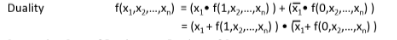
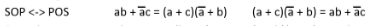

# 2a

## Boolean Algebra Postulates
Basically math rules that apply to boolean algebra.
yk like the ones that apply to normal algebra.

### Closure
For every *a* and *b* in set K = {0, 1}, *a + b* is in K and $a \cdot b$ is in K.   

### Additive Identity
$a+0=a$

#### Multiplicative Identity
$a \cdot 1 = a$

#### Communitative 
$a+b=b+a$

$a \cdot b = b \cdot a$

$ab = ba$

#### Associative
$a+(b+c) = (a+b)+c$

$a(bc) = (ab)c$

#### Distributive
$a+(b \cdot c) = (a+b) \cdot (a+c)$

$a \cdot (b+c) = (a \cdot b) + (a \cdot c)$

#### Additive/Multiplicative Complement
$a+\bar{a} = 1$

$a \cdot \bar{a} = 0$

## Boolean Algebra Theorems

#### Idempotent
$a+a = a$

$a \cdot a = a$

#### Null Elements
$a+1 = 1$

$a \cdot 0 = 0$

#### Involution
$\overline{\bar{a}} = a$

#### Absorption
$a+ab=a$

$a(a+b) = a$

$a(\bar{a}+b) = ab$

$a+\bar{a}b = a+b$

#### DeMorgan's Law
$\overline{a+b+c} = \bar{a} \cdot \bar{b} \cdot \bar{c}$

$\overline{abc} = \bar{a} + \bar{b} + \bar{c}$

#### Consensus 
$ab+\bar{a}c+bc=ab+\bar{a}c$

$(a+b)(\bar{a}+c)(b+c) = (a+b)(\bar{a}+c)$

#### Duality

#### Convertring SoP to PoS

#### Factoring
