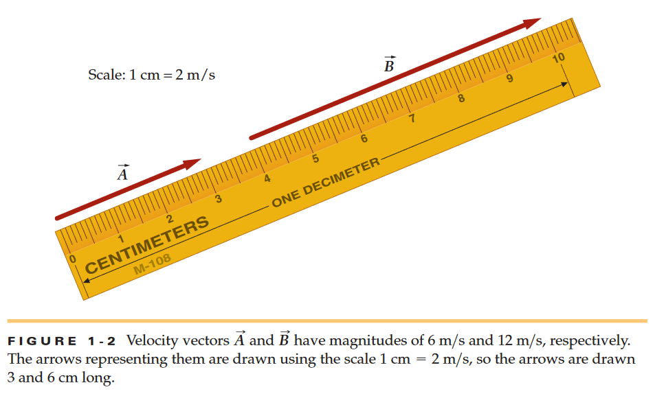
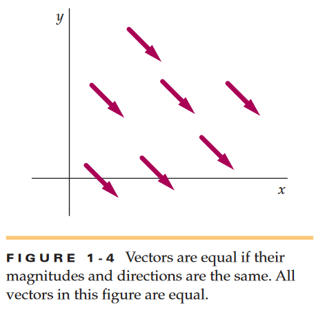
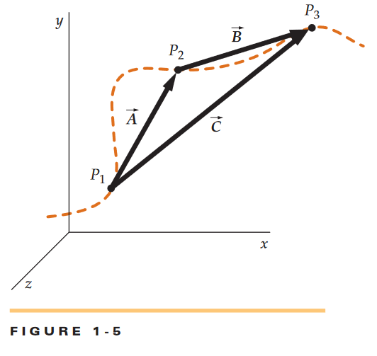
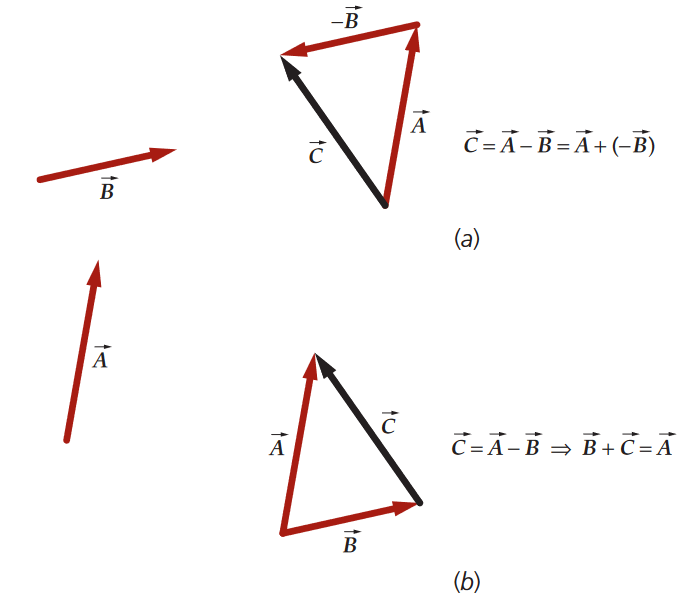
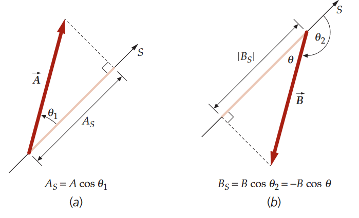
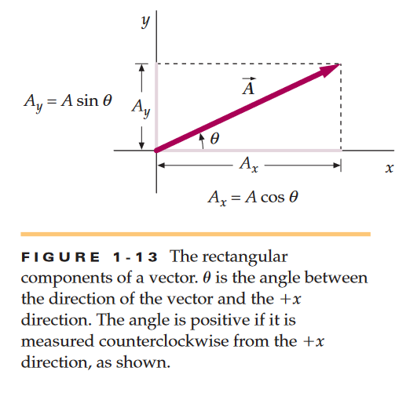
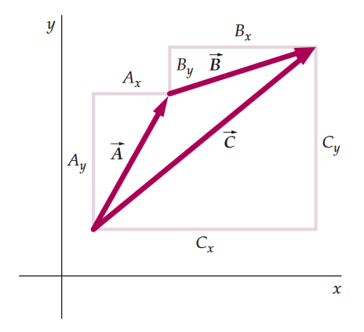
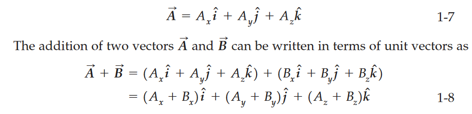
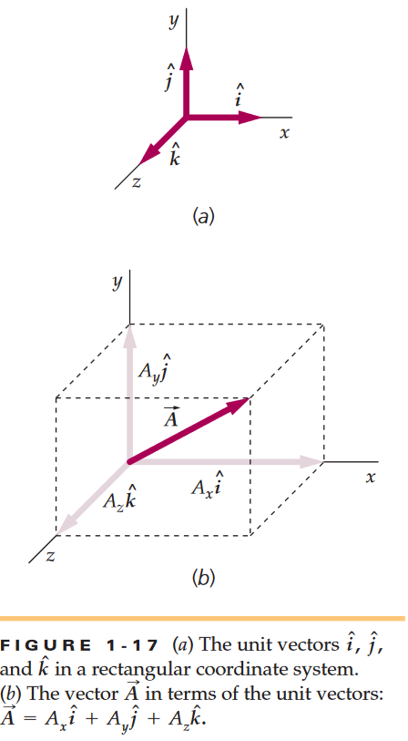
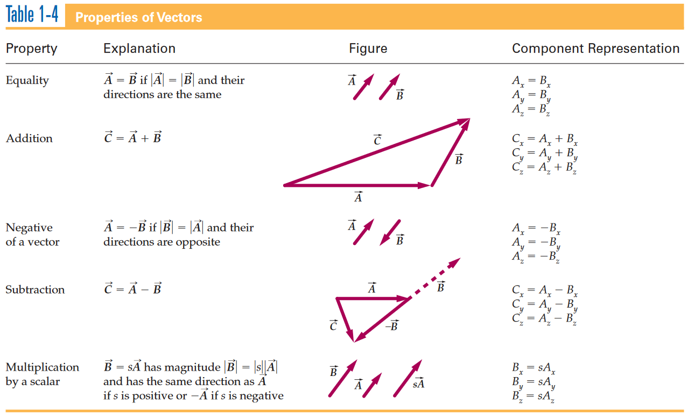

# Chapter 1 Physics Notes

Quantities that have magnitude & **direction** such as velocity, acceleration, and force are called ***vectors***. Quantities that have magnitude but **no** associated direction like speed mass volume time are called ***scalars***.

Vectors are graphically represented as arrows, the length being the magnitude of the vector quantity. The direction of the arrow indicates vector direction.



In Figure 1-2 it shows a representation of two velocity vecotrs. One velocity vector has twice the magnitude of the other and therefore is twice as long. We denote vectors by italic letters with an overheard arrow. The magnitude of a vector is written with one or two lines surrounding each side of it, or simply an italic letter so *A*. For figure 1-2 vector A's magnitude is equal to 6m/s and B's 12m/s

Scalars and vectors can be added, subtracted, and multiplied. However algebraicly manipulating vectors requirse to take into account their direction as well. We will talk about multiplication of vectors later. We will consider displacement vectors (vectors that represent a change in position) because they are the most basic vectors. However these properties apply to **all** vectors not just these.


If an object moves from A to B we can represent its **displacement** with an arrow pointing from A-B, as in Figure 1-3a. The length of the arrow is magnitude or distance between the two arbitrary locations. It is simply a straight line representing the movement made. It does not necesarrily represent teh actual path the object may have taken.



In figure 1-3b the same displacement vector corresponds to all three paths between points A and B. If 2 displacement vectors have the same direction as in figure 1-3c they are **parallel**. If they have opposit edirections like figure 1-3d they are antiparallel. If 2 have the same magnitude and direction they are equal like in figure 1-4. Vectors **do NOT** depend on the coordinate system used to represent them (except position vectors which are in chapter 3). 


Suppose in the below figure 1-5 you take a path from P1 to P2. The dotted line represents the path you may have taken in real life. However the vector A shows the exact physical displacement you carried. Then you moved to P3 from P2 making vector B which is a new displacement vector. Adding vectors A and B gives us a net vector C which is the net displacement carried from original P1 to P3. Vector C is a sum, vector sum, or a resultant.  



The plus sign in adding vectors specifically references vector addition. We find the sum using a geometric process that takes into account both the magnitudes and the directions of the quantities. To add 2 displacement vectors we draw the second vector B with its tail B at the head of the first vector A as seen below. This method is called the head-to-tail method.


Another way of adding vectors is the paralellogram method. It involves drawing vector B so that it is tail to tail with A below.


You can see a diaganol is formed by A and B which adds to C. You can add vectors in any way you want A+B or B+A it doesn't matter (commutative law, associative).  

If you want to add more than two vectors - say A, B, and C - we first add two vectors and then add the third vector to the sum of the two (this is literally just addition this textbook sucks ngl). The order of which you add the vectors doesn't matter, `(A + B) + C = (B + C) + A`

If say two vectors are equal in magnitude but of opposite direction then the vector `C = A + B has a magnitude of 0`. This can be easily seen by the head-to-tail method of vector addition. Any vector of magnitude 0 is called `the zero vector 0`. The direction of a vector with 0 magnitude has no meaning. If `A + B = 0` then B is said to be negative of A and vice versa. Meaning they have the same magnitude but A is in the opposite direction. The negative of A is written -A so if `A + B = 0 then B = -A`.

To subtract a vector B from vector A add the negative of B to A. The result will be `C = A - B = A + (-B)`. An alternative method of subtracting B from A is to add B to both sides of equation `C = A + (-B)` to get `B + C = A`.



The expression `3A` where `A` is an arbitray vector, represents the sum `A + A + A = 3A`. Same thing goes for `(-A) + (-A) + (-A) = 3(-A) = -3A`. More generally the vector A multiplied by the scalar *s* is the vector `B = sA` where B has magnitude `|s|A`. B is the same direction as A if s is positive and therefore opposite if s is negative. The dimensions of `sA` are those multiplied by those of A. (To divide `A` by scalar *s* you multiply `A * 1/s`).

The component of a vector in a given direction is a projection of a vector onto an axis in that direction. We can find vector components by drawing perpendicular lines from the ends of the vector to the axis, as seen below.



```The component of a vector in a specified direction is equal to the magnitude of the vector times the cosine of the angle between the direction of the vector and the specified direction. The component of the vector A in the +S direction is A_s and A_s is positive. The component of the vector B in the +S direction is B_s and B_s is negative.```

The process of finding the components `x, y, & z of a vector is called resolving the vector` into its components.

Note that vectors themselves do not rely on cartesian coordinates but the components do.

We can use right-triangle geometry to find rectangle components of a vector. If theta is the angle measured clockwise* `(assuming +y is 90deg counterclockwise from the +x direction)` from the +x direction to the direction of A, then `A_x = AcosΘ` (x component) and `A_y = AsinΘ`. Where A is the magnitude of vector A. If we know A_x and A_y we can find the angle theta from `tanΘ=(A_y)/(A_x) Θ=tan^-1 (A_y)/(A_x)` and the magnitude of A from the pythagorean theorem, `A = sqrt(A_x ^2 + A_y ^2)`. In 3d `A = sqrt(A_x ^2 + A_y ^2 + A_z ^2)`.



Components can be positive or negative. The x component of a vector is positive if the x coordinate of an ant as it walks from the tail to the head of the vector increases. Thus if A points in the positive x direction then A_x is positive and opposite for negatives. Once we resolve a vector into its components, we can manipulate the individual components. Consider 2 vectors A and B that lie in the *xy* plane. The rectangular components of each vector and those of the sum `C = A + B` are shown in figure 1-15 below. We see that the rectangular parts of the vectors sum up to the equation before.

`C_x = A_x + B_x`

`C_y = A_y + B_y`



A **unit vector** is a dimensionless vector with magnitude exactly equal to 1. The vector  = *A*/A is an example of a unit vector that points in the direction of *A*. The circumflex, (the hat) denotes that it is a unit vector. Usually these are written as i, j, and k respectively. For example the vector A_x i has magnitude |A_x| and points in the +x direction if A_x is positive or -x if A_x is negative. A general vector A can be written as the sum of three vectors, each of which is parallel to a coordinate axis.





***IMPORTANT TABLE***

