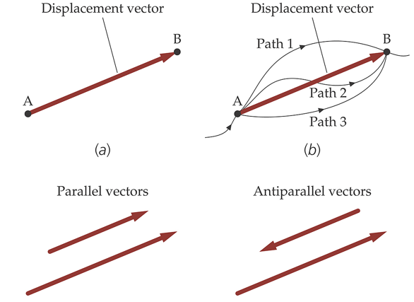
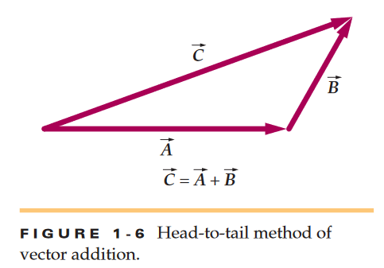
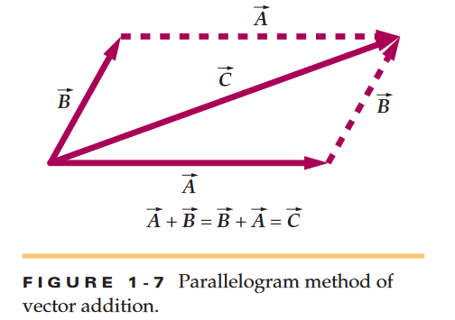

# Chapter 1 Physics Notes

Quantities that have magnitude & **direction** such as velocity, acceleration, and force are called ***vectors***. Quantities that have magnitude but **no** associated direction like speed mass volume time are called ***scalars***.

Vectors are graphically represented as arrows, the length being the magnitude of the vector quantity. The direction of the arrow indicates vector direction.

In Figure 1-2 it shows a representation of two velocity vecotrs. One velocity vector has twice the magnitude of the other and therefore is twice as long. We denote vectors by italic letters with an overheard arrow. The magnitude of a vector is written with one or two lines surrounding each side of it, or simply an italic letter so *A*. For figure 1-2 vector A's magnitude is equal to 6m/s and B's 12m/s

Scalars and vectors can be added, subtracted, and multiplied. However algebraicly manipulating vectors requirse to take into account their direction as well. We will talk about multiplication of vectors later. We will consider displacement vectors (vectors that represent a change in position) because they are the most basic vectors. However these properties apply to **all** vectors not just these.

If an object moves from A to B we can represent its **displacement** with an arrow pointing from A-B, as in Figure 1-3a. The length of the arrow is magnitude or distance between the two arbitrary locations. It is simply a straight line representing the movement made. It does not necesarrily represent teh actual path the object may have taken.

In figure 1-3b the same displacement vector corresponds to all three paths between points A and B. If 2 displacement vectors have the same direction as in figure 1-3c they are **parallel**. If they have opposit edirections like figure 1-3d they are antiparallel. If 2 have the same magnitude and direction they are equal like in figure 1-4. Vectors **do NOT** depend on the coordinate system used to represent them (except position vectors which are in chapter 3). 

Suppose in the below figure 1-5 you take a path from P1 to P2. The dotted line represents the path you may have taken in real life. However the vector A shows the exact physical displacement you carried. Then you moved to P3 from P2 making vector B which is a new displacement vector. Adding vectors A and B gives us a net vector C which is the net displacement carried from original P1 to P3. Vector C is a sum, vector sum, or a resultant.  

The plus sign in adding vectors specifically references vector addition. We find the sum using a geometric process that takes into account both the magnitudes and the directions of the quantities. To add 2 displacement vectors we draw the second vector B with its tail B at the head of the first vector A as seen below. This method is called the head-to-tail method.

Another way of adding vectors is the paralellogram method. It involves drawing vector B so that it is tail to tail with A below.

You can see a diaganol is formed by A and B which adds to C. You can add vectors in any way you want A+B or B+A it doesn't matter (commutative law, associative).  